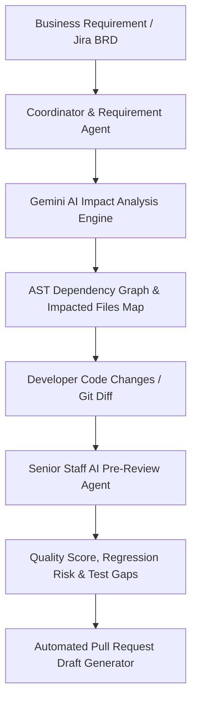

# ImpactIQ - AI-Powered Code Impact Analysis & Pre-Review Platform

ImpactIQ is an intelligent developer intelligence platform that analyzes software requirements against codebase structures, generates predictive impact maps, performs automated Senior Staff AI code reviews, and drafts GitHub pull requests using **Google Gemini AI**.

---

## 🚀 Architecture Overview



---

## 🛠️ Technology Stack

- **Frontend**: React 19, Vite, React Router 7, Lucide Icons, Vanilla CSS Design System
- **Backend**: Node.js (ES Modules), Express 5, Google GenAI SDK (`@google/genai` with Gemini 2.5 Flash), Mongoose / MongoDB fallback, `parse-diff`
- **Proxy**: Seamless `/api` routing via Vite dev server proxy to Express backend

---

## 🏁 Quick Start Guide

### 1. Backend Setup
```bash
cd backend
npm install
npm start
```
> Running on: `http://localhost:5000`

### 2. Frontend Client Setup
```bash
cd frontend
npm install
npm run dev
```
> Running on: `http://localhost:5173`

---

## 🧩 Pages & Features

1. **Dashboard (`/dashboard`)**:
   - Live repository switcher (`impactiq-backend`, `impactiq-frontend`, `payment-gateway`).
   - Dynamic telemetry cards (Tracked files, Test coverage, Indexed requirements).
   - Real-time Multi-Agent Workflow progress tracker.
   - Clickable AI Analysis History table.

2. **Requirement Analysis (`/requirements`)**:
   - Selectable Jira presets (`JIRA-241`, `JIRA-182`, `JIRA-305`) or custom BRD input.
   - One-click Gemini AI Impact Analysis trigger.

3. **Code Impact Analysis (`/impact-analysis`)**:
   - AI Suggested Starting Map (Primary files to edit, Upstream/Downstream impact, Test suites).
   - Interactive AST Dependency Graph with clickable node inspection.
   - Impacted File Registry categorized by risk level.

4. **AI Code Pre-Review (`/code-review`)**:
   - Raw Git diff editor and analyzer.
   - Senior Staff AI report covering standards, regression risk, and test coverage gaps.

5. **PR Generator (`/pr-generator`)**:
   - Synthesizes requirement and code review into a GitHub Pull Request draft.
   - One-click Copy PR, Export Markdown, and Submit actions.

6. **AI Agent Network (`/agents`)**:
   - Multi-agent orchestration console with throughput and accuracy telemetry.

7. **Analytics (`/analytics`)**:
   - Hotspot file frequency, defect prevention metrics, and microservice quality health bars.

8. **Settings (`/settings`)**:
   - Model engine selector (Gemini 2.5 Flash / 1.5 Pro) and backend endpoint configuration.
